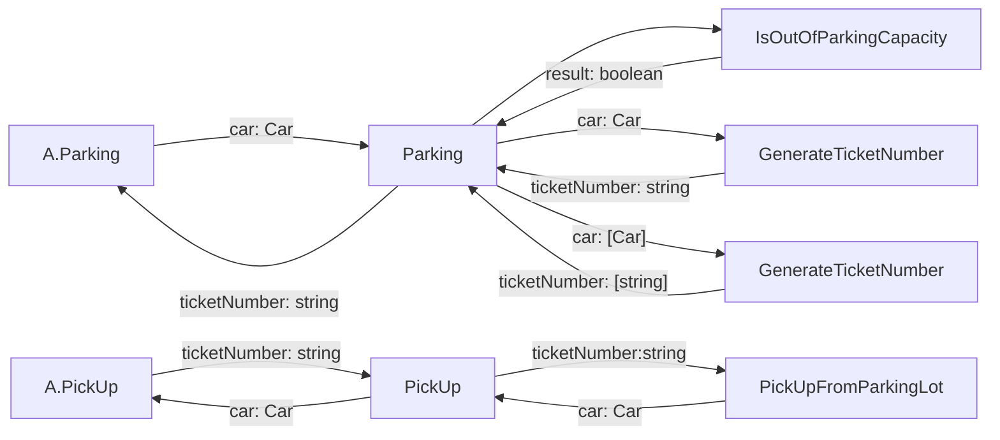

# CLI Version

Please read the story and do your implementation.

## Story 1

As a customer, I would like to give my car to a parking boy so that he can help me park a car to the parking lot.

AC1: The parking boy can park a car into the parking lot and returns a parking ticket. The customer can give the parking
ticket back to the parking boy to fetch the car.

AC2: The parking boy can park multiple cars into on parking lot. And can fetch right car using correspond ticket.

AC3: If the customer gives a wrong ticket (the parking boy does not provide the ticket) or does not give a ticket. Then
no car should be fetched.

AC4: If the customer gives a ticket that has already been used. Then no car should be fetched.

AC5: The parking lot has a capacity (the default capacity of a parking lot is 10). If there is no position, then the
user cannot park the car into it. Thus (s)he will not get any ticket.

> There are some cases which are not a requirement but may happen technically
>
> * Passing a parked car to a parking boy.
> * Passing a `null` car to a parking boy.

### Tasking

1. given a car to parking boy when customer to the parking lot then return a parking ticket
2. given a ticket to parking boy when customer to the parking lot then return a car
3. given three car to parking boy when customer to the parking lot then return three parking ticket
4. given parked car to parking boy when customer to the parking lot then throw CarParkedException
5. given null car to parking boy when customer to the parking lot then throw IllegalCarException
6. given a wrong ticket to parking boy when customer to the parking lot then return null
7. given a ticket has been used when customer to the parking lot then return null
8. given capacity of parking lot is 10 and it`s full when customer to the parking lot to a car then return null

## Story 2

As a customer, I would like to get some response message from the parking boy when I cannot fetch the car. So that I can
know what happens.

AC1: When the customer gives a wrong ticket (the parking boy does not provide the ticket / the ticket has been used).
Then no car should be fetched. If I query the error message, I can get an "Unrecognized parking ticket.".

AC2: When the customer does not provide a ticket when fetching a car. The error message should be "Please provide your
parking ticket."

AC3: When the parking boy attempt to park a car into a parking lot without a position. The error message should be "Not
enough position."

### Tasking
1. given a wrong ticket to parking boy when customer to the parking lot then return Unrecognized parking ticket
2. given a null ticket to parking boy when customer to the parking lot then return NoTicketException
3. given capacity of parking lot is 10 and it`s full when customer to the parking lot to a car then return Not
   enough positionException

## Story 3

As a parking lots service manager, I would like to have a parking boy parking cars to multiple parking lots. So that I
can provide more parking positions.

AC1. The parking boy is not that clever, and he will always park cars sequentially (suppose that there are two parking
lots managed by the parking boy. The parking boy will park cars to the second parking lot when the first parking lot is
full).

AC2: All the requirement in *Story 1* and *Story 2* **MUST** be satisfied.

### Tasking
1. given a car to parking boy when customer to the parking lot then return a parking ticket
...

## Story 4

As a parking lots service manager. I would like to have another kind of parking boy to help me parking cars to multiple
parking lots. So that the parking positions can be better used.

The new kind of parking boy is called **SMART PARKING BOY**.

AC1. The smart parking boy will always park cars to the parking lot which contains more empty positions.

AC2: All the requirement in *Story 1* and *Story 2* **MUST** be satisfied.

## Story 5

As a parking lots service manager, I would like to have another kind of parking boy to help me parking cars to multiple
parking lots so that the parking positions can be better used.

The new kind of parking boy is called **SUPER SMART PARKING BOY**.

AC1. The super smart parking boy will always park cars to the parking lot which has a larger available position rate (*
positions available* / *total capacity*).

AC2: All the requirement in *Story 1* and *Story 2* **MUST** be satisfied.

## Story 6

As a parking lot service manager, I would like to manage several parking boys (including all three kinds of parking
boys). And at the same time, I can act as a standard parking boy too. So that our work can be most efficient.

Each parking lot service will have only one manager.

AC1. The parking lot service manager can add parking boys to management list. And the parking lot manager can specify a
parking boy on the list to park or fetch the car (only from the parking lots managed by that parking boy).

AC2. The parking lot service manager can also manage parking lots. And (s)he can park or fetch the car just as a
standard parking boy (*Story 3*). Note that (s)he can only store and fetch the car from his/her own parking lots.

AC3. If the manager tells the parking boy to park or fetch the car, then the manager should be able to display the error
message to the customer if the parking boy failed to do the operation.

### Tasking
given parking boy and parking lot list when parking car then parking boy